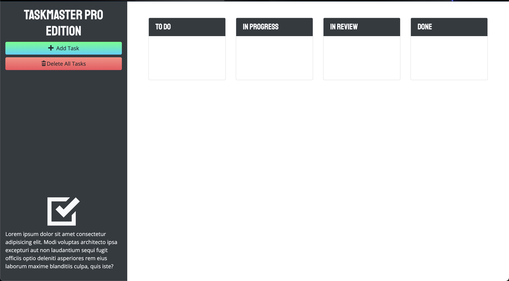

# Taskmaster-Pro

## Front End Project Using HTML, CSS, JS, jQuery and Bootstrap

This application is a user interactive task creater. The user can generate add a due date for each task created. Each new task created is initially created under the To Do section of the webpage. The user can drag and drop the task into different sections of the page depending on the status of the task. The user also has the ability to drag and drop an individual task into the trash, which only appears when a task is being dragged. This feature was created via jQuery and JavaScript. The user also has the option to delete ever task with a simple click of the Delete All Task button. 

The application can be accessed using this link: https://charanvir.github.io/Taskmaster-Pro/

Below is a screenshot of the deployed application:
- 